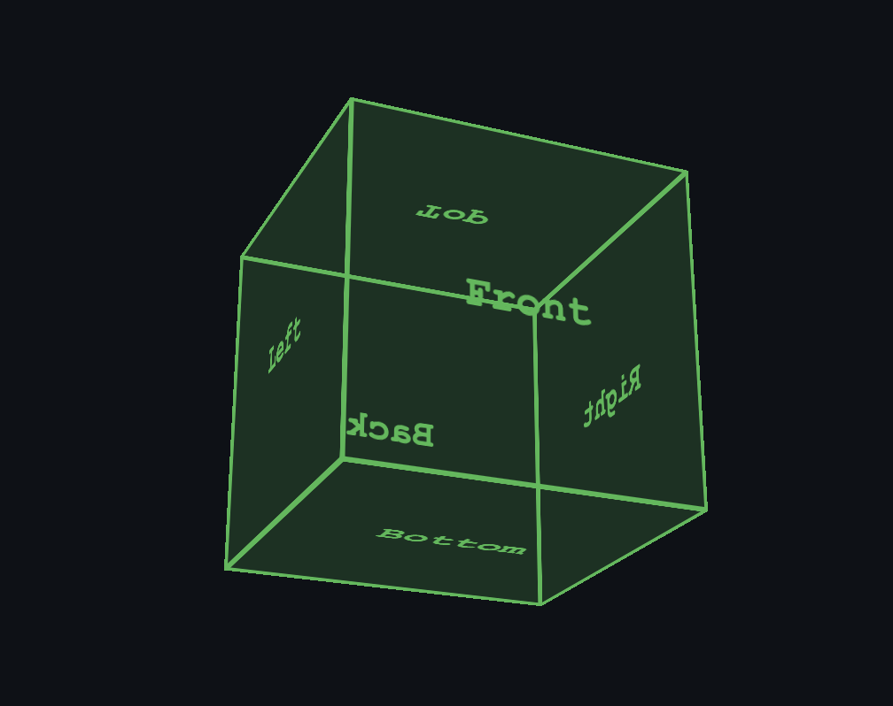

# 3D CSS Cube

An interactive 3D rotating cube with click-drag controls built with CSS and JavaScript.



## Live Demo

**[cube.kahdev.me](https://cube.kahdev.me)**

## Description

An interactive 3D cube that can be rotated by clicking and dragging, with keyboard controls and auto-rotation toggle. Built with HTML, CSS 3D transforms, and JavaScript.

## Technologies

- HTML5
- CSS3
  - 3D Transforms (`perspective`, `rotateX`, `rotateY`, `translateZ`)
  - Keyframe animations
  - Flexbox positioning
- JavaScript
  - Mouse and touch event handling
  - Keyboard controls

## Features

- Click and drag to rotate the cube in any direction
- Auto-rotation with pause/resume controls
- Keyboard controls:
  - `Space` - Toggle auto-rotation
  - `Arrow keys` - Manual rotation when paused
  - `R` - Reset to default position
- Touch support for mobile devices
- Smooth animations and transitions
- Terminal-inspired dark theme matching [kahdev.me](https://kahdev.me)
- Responsive design
- Semi-transparent cube faces with green accent color

## Usage

### Local Development

Clone the repository:
```bash
git clone https://github.com/khesse-757/cube.git
cd cube
```

**Option 1: Direct open**
```bash
open index.html  # macOS
# or
start index.html  # Windows
# or just double-click the file
```

**Option 2: Local server (recommended)**
```bash
python3 -m http.server 8000
```

This starts a local web server on port 8000, allowing you to test the site at `http://localhost:8000` exactly as it would appear when deployed.

Then open your browser to: **http://localhost:8000**

## Structure
```
cube/
├── index.html        # Main HTML structure
├── style.css         # CSS animations and styling
├── script.js         # Interactive controls
├── CNAME            # Custom domain configuration
└── README.md        # This file
```

## How It Works

The cube uses CSS `transform-style: preserve-3d` to maintain 3D space, with each face positioned using:
- `rotateY()` for front/back/left/right faces
- `rotateX()` for top/bottom faces  
- `translateZ()` to push faces outward from center

JavaScript handles mouse/touch events to update rotation values in real-time, applying transforms to the cube element.

## Customization

Adjust rotation speed in `style.css`:
```css
.cube.auto-rotate {
    animation: rotate 10s infinite linear;  /* Change 10s to adjust speed */
}
```

Change cube size in `style.css`:
```css
.cube,
.face {
    width: 200px;   /* Adjust size */
    height: 200px;
}

.front  { transform: rotateY(0deg) translateZ(100px); }  /* Half of width */
/* Update all translateZ values to half of new size */
```

Modify rotation sensitivity in `script.js`:
```javascript
rotationY += deltaX * 0.5;  // Change 0.5 to adjust sensitivity
rotationX -= deltaY * 0.5;
```

## License

MIT License - feel free to use this code for your own projects.

## Part of kahdev.me

This is a standalone project from my personal site: [kahdev.me](https://kahdev.me)

Check out more projects at [kahdev.me/projects](https://kahdev.me/projects)

## Author

- Website: [kahdev.me](https://kahdev.me)
- GitHub: [@khesse-757](https://github.com/khesse-757)